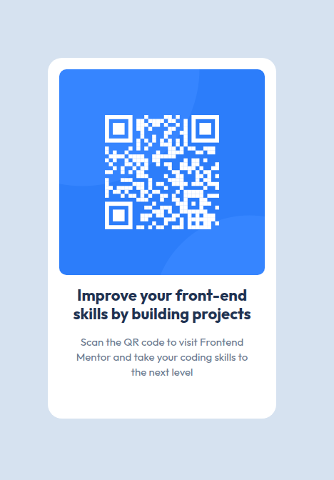

# QR code component

This is a solution to the [QR code component challenge on Frontend Mentor](https://www.frontendmentor.io/challenges/qr-code-component-iux_sIO_H).

Live Site URL: [QR Code](https://skharat8.github.io/component-qr-code/)

## Screenshot

## My process

### Built with

- Semantic HTML5 markup
- CSS custom properties
- [React](https://reactjs.org/) - JS library

### What I learned

In this, I extracted styles from a Figma design file and defined CSS variables to use them in the component. I also had to figure out how to have a max width on desktop while maintaining a padding on mobile for the main wrapper. This was a basic exercise, but still useful to understand how to work with design files.
